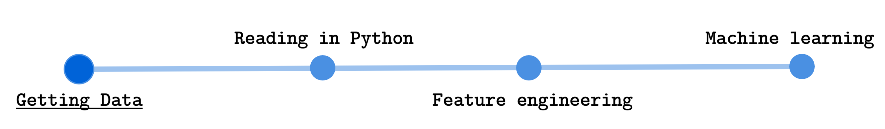
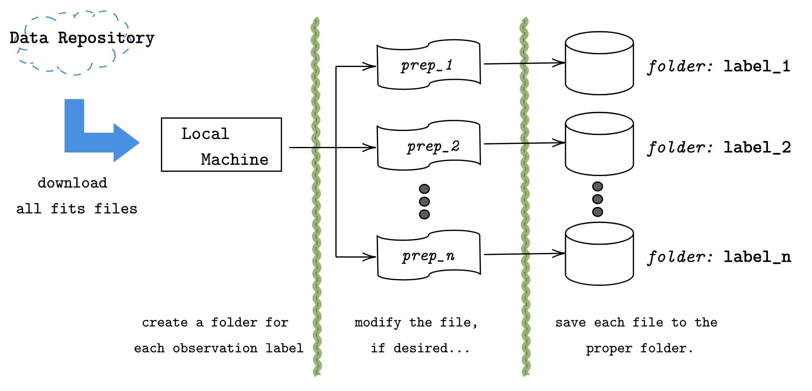
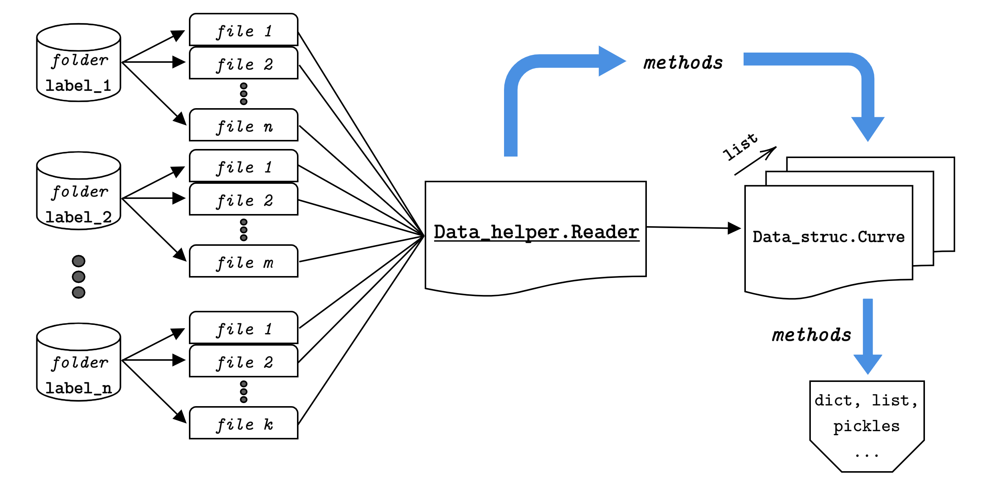
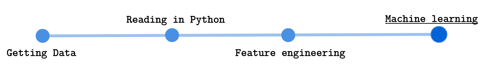

.. CRT Contrib documentation master file, created by
   sphinx-quickstart on Wed Apr  1 15:43:53 2020.
   You can adapt this file completely to your liking, but it should at least
   contain the root `toctree` directive.

Welcome to CoRoT Contribution's documentation!
================================================

Here the summary results and developments of the project called A Data Analysis Pipeline 
for the CoRoT Light Curve Data, supported by NSEE and FAPESP. The pipeline major three 
specific topics that will allow any user with basic knowledge in Python to reproduce the 
analysis. The work is called here also by its repository name: *CoRoT Contributions*. 

This work fundamentally rely on multidiscipline knowledge, passing by computation, 
mathematics, signal analysis and phisycs. The main idea is to show how to implement this 
fields knowledge to solve a practical problem, therefore no introduction level discussion 
is expected. The focus relies on high level discution on most of those subjects.

In this documentation first an **Introduction** on the CoRoT mission is presented to bring 
the reader more close to the problem faced by the astronomical community and clearify the 
importance of the proposed problem. Thence, the **Problem** that will be faced is presented
and discussed to introduce the necessary knowledge to interpret the data and understand some 
decisions taken during the project developments. Finally the data processing **Pipeline** is 
presented with all the algorithms and analysis necessary to get to the exoplanet classifier 
presented as the project results.

Finally, all pipeline steps are presented in a detailed manner, by going through all the 
low-level computations, with code examples. Leading the way to the final results obtained, 
and reports.

.. seealso:: 
   This documentation is just a guide trough how one can use the provided python libraries 
   do go from the raw data collected from the CoRoT satellite, to a simple architecture to be 
   used on machine learning algorithms. Then, some examples of how to use theses features on 
   machine learning classifiers are presented. If one also wants to check other possible 
   applications please check the GitHub repository.

Introduction to CoRoT
---------------------

The CoRoT (Convection, Rotation and planetary Transits) was the first mission dedicated and 
designed for the exoplanetary research. Operated in a lower Earth orbit, has the objectives of 
using its CCD widefield cameras to obtain and gather light information for the study of supposed 
exoplanetary behaviors. The project, launched in 2006 had nominal lifetime of 2.5 years, but it 
actually ended in 2014 when it was de-orbited. The project was led by CNES, with contributions 
from ESA, Austria, Belgium, Germany, Spain and Brazil.

One of the key information collected by the CCD cameras was the light intensity from the planets, 
which there is a collection of thousands of light curves observations of different candidates. 
Interesting enough, this information are actually from exoplanets candidates, and the astronomical 
community is now working on classifying those observations to map which ones are actually exoplanets 
from those who are not. There are several methods to detect exoplanets and get information from them, 
as an example, there are:

- Radial velocity
- Transit photometry
- Relativistic beaming
- Gravitation microlensing

and several others. Here, teh transit photometry approach will be used, and a further explanation on 
this technique will be presented on the next section. No more will be discussed from the other thecniques, 
but the reader is free to check it out how those work. The only interesting subject that most of those 
has in common is that their collected information are time series (dynamical information), and most of 
the techniques presented in this study could be used similarly for all of them.

For more reference on works regarding the classification of the light curves observations one 
might check the following `M. Deleuil1, S. Aigrain2, et al <https://www.aanda.org/articles/aa/pdf/2018/11/aa31068-17.pdf>`_.

For more details on the CoRoT mission please check out the `ESA CoRoT site <https://sci.esa.int/web/corot>`_.

Problem proposed
----------------

Being as concise as possible, the main goal is to use machine learning to automate 
the classification of CoRoT collected data, as a way to cluster data that has meaningful 
information to be analyzed from data that has none. This means that we want to classify 
data that present possible exo-planets, from data that has information about something 
other then exo-planets.

To provide a brief introduction to the knowledge needed to achieve this goal, we will 
describe the data set a little bit. The data set is provided by the repository provided 
at `the web site <http://idoc-corot.ias.u-psud.fr/sitools/client-user/COROT_N2_PUBLIC_DATA/project-index.html>`_ , 
where it contains files in a *.fits* format. Those are pretty common in the 
astronomical whereabouts, but not for the machine learning public. In each *.fits* 
file, we will have a light curve time series for a particular CoRoT observation. 
All observations will have the white light intensity, some will have the RGB, but all 
will have the white light intensity along the observation time. 

Those time series, are not the light intensity provided by the observed exo-planet, but 
actually, the light intensity emission of the star in which the supposed exo-planet is 
orbiting around. Notice, that we have the Transit photometry information for this 
particular exo-planet.

Therefore, we are talking about using the transit photometry time series to classify if 
in this particular observation there is a chance for the observation be one of an exo-planet, 
or something else. As an illustration, one will have time-series data, that will contain 
the planetary transit information such in

.. image:: images/planetary_transit.svg
   :width: 600

So the features for the machine learning algorithm must be gathered from the time series,
and the algorithm must reach for the probability of this observation be the observation 
of an exo-planet.

Pipeline
--------

The preprocessing pipeline consists on four major steps:

* Getting the data - (10\%)
* Reading in Python - (20\%)
* Feature Engineering - (50\%)
* Machine Leaning - (20\%)

.. admonition:: Notice

   In these items, we introduced the usual percentage of the work amount usually taken for 
   each particular part of a machine learning project. This is usually the amount when you 
   have features that do not involve time, dynamic features... therefore static information, 
   which is mostly used to happen, such as in problems of customer clustering, when one has 
   features such 
   
   .. hlist::
      :columns: 5
      
      * Age
      * Salary
      * Address
      * ...

   Note that these features do not change over time. Here we have a time series, so we have 
   to somehow extract from those time series, some static information. So be prepared for the 
   feature engineering part of the pipeline!

.. warning::

   Note that the first three pipeline steps will generate a data file, with the processed data 
   for the next step. The user can choose to either follow each process step and by it self 
   generate and preprocess the data. Or one can go the google drive link bellow 
   
   * `Google drive access <https://drive.google.com/drive/folders/19kALbQ5m1ppXxGTVMBaWA4KdIE9pmWfM?usp=sharing>`_ 
   
   and download the already preprocessed data. For example, if the user wants to jump all 
   the three first steps and just have access to the features for the machine learning 
   algorithm, one can download then from the folder `/features` in the google drive.

To get the data on your local machine, first one mush address to the 
`data repository web site <http://idoc-corot.ias.u-psud.fr/sitools/client-user/COROT_N2_PUBLIC_DATA/project-index.html>`_ 
where we will have the soo called level N2 processed data from the CoRoT observations. 
Those are the most processed versions of the CoRoT collected data. At this repository, 
one will find five classes of observations,

* CoRoT bright: the called bright stars (examples of not exo-planets)
* CoRoT targets: the called exo-planets (examples of exo-planets)
* Red giants: the observations classified as red giants (examples of not exo-planets)
* Stars with rotation periods from Affer (not used)
* Stars with rotation periods from Medeiros (not used)

The last two classes will not interest us. We actually will only use the first three 
collection of data. Those collections have information of transit photometry or only 
light curve intensity, furthermore their labels allow us to segregate the information 
as not exo-planet and exo-planet. While the last two, provide labels that cannot ensure 
if the collected data is from an exo-planet observation or not.

If the user select one of the three categories, it will show a table with several items.
Each item is a particular light curve observation, and the user can select and download 
any of the curves that he desires.

After that one might also download another class of light curve observations called 
eclipsing binaries from the `data repository <http://idoc-corot.ias.u-psud.fr/sitools/client-user/COROT_N2_PUBLIC_DATA/project-index.html>`_ 
in the Query Forms tab in the FAINT STARS option. There the user will be able to query 
each curve from their specific CoRoT Id. Then by searching the stars CoRoT Id from the 
tables at the `CoRoT transit catalog <http://cdsarc.u-strasbg.fr/viz-bin/qcat?J/A+A/619/A97>`_, 
it is possible to reach a group of close to 1500 eclipsing binaries.

.. note:: 
   One interesting aspect of the eclipsing binaries is that their light curves are pretty 
   close to the exo-planets ones. Therefore it is pretty difficult to cluster eclipsing 
   binaries from exo-planets using only the light curve. This is the most interesting 
   case study of this project.

After downloading for the three classes (bright stars, confirmed targets and red giants) 
the user must keep each class in a particular folder, with the name that the user wants 
to label each class. As schematized in the figure above.

It is advised to keep a database folder following the structure::

   ./database 
      │
      ├── bright_stars
      │     ├── ..._1.fits
      │     ├── ..._2.fits
      │     ⋮       ⋮
      │     └── ..._k.fits
      │
      ├── confirmed_targets
      │     ├── ..._1.fits
      │     ├── ..._2.fits
      │     ⋮       ⋮
      │     └── ..._l.fits
      │
      ├── eclipsing_binaries
      │     ├── ..._1.fits
      │     ├── ..._2.fits
      │     ⋮       ⋮
      │     └── ..._m.fits
      │
      └── red_giants
            ├── ..._1.fits
            ├── ..._2.fits
            ⋮       ⋮
            └── ..._n.fits

.. admonition:: Drive files access

   If the user does not want to go through the process presented above and just want to 
   download the data, already in the format presented above, it is possible to get it 
   from my google drive, or in the direct download link:

   .. hlist::
      :columns: 2

      * `Google drive access <https://drive.google.com/drive/folders/19kALbQ5m1ppXxGTVMBaWA4KdIE9pmWfM?usp=sharing>`_ 
      * `Direct download <https://drive.google.com/uc?export=download&id=ttps://drive.google.com/drive/folders/19kALbQ5m1ppXxGTVMBaWA4KdIE9pmWfM?usp=sharin>`_ 

   The files are something close to tens of GB. Since it contains all the raw fits files
   for the three classes (bright stars, red giants, confirmed targets and eclipsing binaries).

After getting the data from the online repositories, we need to transform this data into data 
structures more python friendly, such as dictionaries, lists, arrays, or into files with more 
suitable formats then *fits* files, *e.g.* pickle files, or MATLAB files (if one wants to 
algorithms on MATLAB).

For that, we create here a preprocessing library called :py:class:`Reader <utils.data_helper.Reader>` 
that transform the data from the fits files into simple objects of the class :py:class:`Curve <utils.data_struc.Curve>` 
that simplifies the information access, and make it faster, provided that it works with the so-called 
memory maps and only save HUD tables that will be necessary for the future. This process reduces the 
dataset up to 80\% (the data that was something close to 40 GB, is now something close to 7 GB).

The next scheme illustrates the process applied to the data to create this interface from the *.fits* 
format into the python friendly form:

From the above scheme, we can see that the process starts from the *fits* files and after passing 
through the :py:class:`Reader <utils.data_helper.Reader>`, we achieve a structure that with simple calls 
to the information variables, it is possible to get that variable data in `dict` and/or `list` formats.

After reading the data, and before saving in a format such as the pickle file, we also apply a preprocessing 
technique to filter out the noise of the time series. This technique is applied here instead of in the 
feature engineering step, just to show the user the importance to understand the feature processing part 
with an information extraction practical example. Showing that a simple filtering technique can enable access 
to several other pieces of information. And by that, engaging the user to see the next step of the pipeline, 
which will have several other feature engineering techniques. 

----

The feature engineering process is the part that takes most work in a machine learning project. It is the 
part where one must extract meaningful information from the data to provide for the machine learning 
algorithms. But interesting enough, one cannot know beforehand what information is actually the best one 
for the machine learning algorithm. Most machine learning projects, the data is actually static (does 
not depend on time) and have a simpler path to be taken, where the only usual procedure is done in the 
feature engineering is the common normalization and feature reduction (when the dimension of the features 
are very high and the learning algorithm is pretty heavy). But in the case of time series classification, 
the user has dynamic data... which needs to be transformed to static data, to then go through the common 
feature engineering processes.

There are several paths that one might take to get static information from the data when one has a time 
series in the hands. Some of the techniques are presented:

* Power spectrum
* Periodograms
* Number of peaks
* Dynamic insights

The first two, are not much than the Fourier representation of the data, which is actually the most 
characteristic information of the time series. The second is just commonly used info in the internet 
tutorials (which is a very noisy scenario, which will only generate more noisy data). The last one usually 
is a very powerful approach, in which, we first use the data to estimate a dynamical model of the time 
series phenomenon, and then use that model parameter to cluster each time series. The most interesting 
part of this approach is that it relies on the leaning algorithm focus to enhance certain behaviors of 
the dynamic model and mitigate the effects of others.

Usually, people abuse simple least-squares or deterministic techniques to acquire the parameters of a 
particular structure model. Here we will present a stochastic approach of this technique, where we will 
estimate stochastic and probabilistic models for the time series, and their parameters will then be used 
as features for the machine learning process.

Here the bellow features will be generated for the machine learning algorithm:

* Periodograms
* Bayes marginal likelihood
* Hidden Markov Models
* Latent Dirichlet Allocation

The first one is the classical technique (which present several concerns and computation problems, due 
to the Fourier algorithms). The second one uses probabilistic Bayes Models parameters as features. The 
third uses the estimated parameters for Hidden Markov Models as features. And the fourth one actually 
is a very complex technique usually used to cluster text into speech topics, and here is used outside 
its scope, to check if the topic's classification also can be applied to time series dependencies.

.. note::
   Provided that each approach is more unique than the other, here it will not be discussed further more 
   about any one of them. A more detailed description will be presented in the Feature Engineering step 
   of the documentation.

The machine learning step of the pipeline, does nothing much more than the basics machine learning procedures
once the time series static information is provided. From the last step, simple features where build from the 
time series. using the following techniques:

* Periodograms: produces the evenly reshaped power spectrums
* Bayes marginal likelihood: produces the Ridge Bayesian model parameters
* Hidden Markov Models: produces the Markov trasition matrices

And now it is desired to build a machine learning algorithm that will take each one of those features and try 
to classify the observation classes. Therefore, we just want to distinguish between the four labels:

* Red giants
* Confirmed targets or exo-planets
* Bright stars
* Eclipsing binaries

The astronomical community show a particular interest in distinguish specifically two of those classes from each 
other: the confirmed targets from the eclipsing binaries. This challenge show itself to be appealing because there 
is several difficulties in distinguishing the eclipsing binaries and exo planets light curve information using 
classical theory. Therefore, having an automate algorithm capable of solving this enigma would be most attractive.

Thence here we present three major algorithms to classify the data from exo-planets and eclipsing binaries. The 
first is using the `XGBoost library <https://xgboost.readthedocs.io/en/latest/>`_, since it is proven to be a 
very powerful algorithm in machine learning forums and competitions, such as `Kaggle <https://www.kaggle.com/>`_.
Also, some classic algorithms will be used, such as Decision Trees from the `scikit learn <https://scikit-learn.org/stable/>`_ 
packages to compare the boosting feature capability from the XGBoost algorithms, and some powerful mathematical 
algorithms such as Support Vector Machines classifiers, which is supposed to be analytically optimal.

All the algorithm will follow the common machine learning path, such as:

* Read the features and labels
* Encode, normalize, reduce features and reshape
* Make train and test data-set
* Build the machine learning model
* Search hyper parameters
* Train machine learning model
* Validate the model
* Analyse the results

So the reader can understand that for any of the models and any of the features, after the Feature Engineering 
pipeline, the algorithm is pretty much the same. Therefore, the price of dealing with time series data, is that 
one must have the Feature Engineering pipeline to extract static information from the data, before going through 
the common machine learning pipeline.

.. note::
   As in the previous pipeline step, the algorithms will not be further discussed here. If the reader wants, a 
   more detailed description of each machine learning approach can be found on its respective chapter of the 
   documentation, with application example.

.. toctree::
   :maxdepth: 3
   :caption: Reading and Plotting

   01 - Reading and Plotting

.. toctree::
   :maxdepth: 3
   :caption: Feature Engineering

   02 - Building and creating features

.. toctree::
   :maxdepth: 3
   :caption: Machine Learning

   03 - Machine Learning - XGBoost Classifier
   03 - Machine Learning - Decision Trees

.. toctree::
   :maxdepth: 3
   :caption: Code APIs

   modules

Indices and tables
==================
* :ref:`genindex`
* :ref:`modindex`
* :ref:`search`